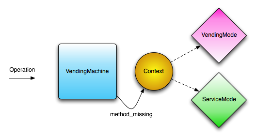

Vending
=======

This is an implementation of a vending machine as per the spec from the Lambda Lounge language shootout ([Vending Machine Specification](http://stllambdalounge.files.wordpress.com/2009/03/vendingmachinespecification.pdf))

You will need Ruby 1.9 to run the specs/code

The core concept of this implementation is illustrated as follows:  

Copyright
---------

Copyright (c) 2009 Mario Aquino. See LICENSE for details.
